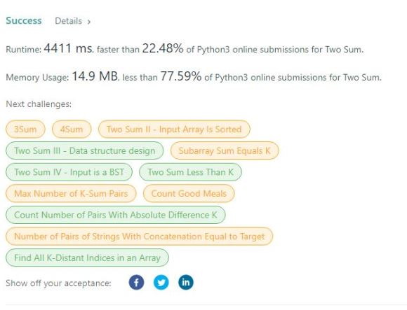
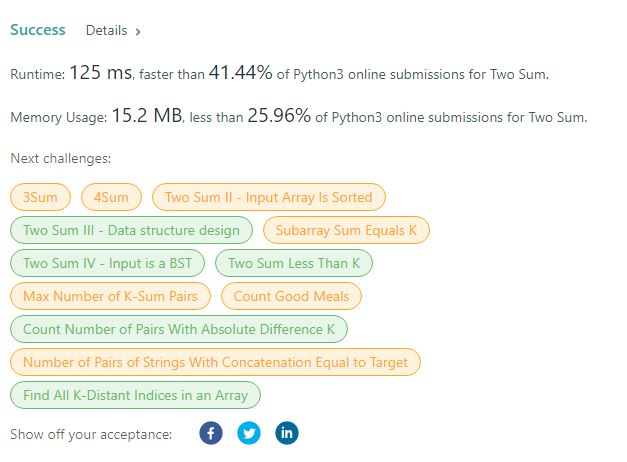
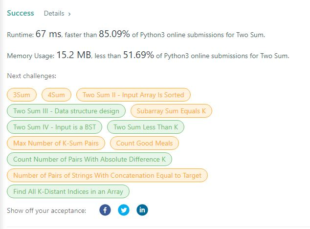

# Johni A Kim - 1. Two Sum 

### Visit My Other Project Categories!

<details><summary><strong>Category List</strong></summary> 
<br>

[Personal Projects](https://github.com/JohniAKim/PersonalProjects)
  - [Database Architecture and Modeling](https://github.com/JohniAKim/PersonalProjects/DBArchModeling)
  - [Documentation Samples](https://github.com/JohniAKim/PersonalProjects/DocSamples)
  - [Educational](https://github.com/JohniAKim/PersonalProjects/Educational)
  - [Health and Fitness](https://github.com/JohniAKim/PersonalProjects/HealthFitness)
  - [Microsoft Access](https://github.com/JohniAKim/PersonalProjects/MSAccess)
  - [Visualizations](https://github.com/JohniAKim/PersonalProjects/Visualizations)

</details>

## Background

This the Two Sum problem from leetCode.

## Summary

The [Jupyter Notebook](0001_TwoSum.ipynb) gives three solutions and the thought process that led to each solution.

- The first solution is the off-the-hip initial logic, involving nested `for..loop` and has a time complexity of ***O(n<sup>2</sup>)***
- The second solution uses a `hashmap` (python dictionary) and one `for..loop` to reduce time complexity to ***O(n)***
- The third solution emphasizes the short-comings of ***Big O*** by showing how minor code adjustments can optimize the second solution significantly yet still having a time complexity of ***O(n)***

### Solution 1 

The first solution is the off-the-hip initial logic, involving nested `for..loop` and has a time complexity of ***O(n<sup>2</sup>)***.  The time performance is horrible as we expected.  The space complexity of ***O(n)*** is expected because we only use one copy of the data for all operations.  





### Solution 2 Results

The second solution uses a `hashmap` (python dictionary) and one `for..loop` to reduce time complexity to ***O(n)*** due having to traverse the array only once along with the ***O(1)*** operations to search the hashmap.  Space complexity is still ***O(n)*** even though we have another copy of the data in the hashmap (effectively *O(2n)* which reduces to *O(n)*).  





### Solution 3 Results

The third solution has the same logic as *Solution 2* but uses a variable to store the calculation of `target - number` and then uses the variable to perform the search in the hashmap.  Even though the steps add up to the same for time complexity of ***O(n)*** for the algorithm, there is a dramatic different in execution time.  




## The Problem
Original: [1. Two Sum](https://leetcode.com/problems/two-sum)

### 1. Two Sum

Given an array of integers `nums` and an integer `target`, return *indices of the two numbers such that they add up to* `target`.

You may assume that each input would have ***exactly one solution***, and you may not use the *same* element twice.

You can return the answer in any order.

#### Example 1:

**Input**: nums = [2,7,11,15], target = 9  
**Output**: [0,1]  
**Explanation**: Because nums[0] + nums[1] == 9, we return [0, 1].

#### Example 2:

**Input**: nums = [3,2,4], target = 6  
**Output**: [1,2]

#### Example 3:

**Input**: nums = [3,3], target = 6  
**Output**: [0,1]

**Constraints**:

* 2 <= nums.length <= 10<sup>4</sup>
* -10<sup>9</sup> <= nums[i] <= 10<sup>9</sup>
* -10<sup>9</sup> <= target <= 10<sup>9</sup>
* **Only one valid answer exists.**

**Follow-up**: Can you come up with an algorithm that is less than `O(n2)` time complexity?

#### Provided signature:

```python
    class Solution:
        def twoSum(self, nums: List[int], target: int) -> List[int]:
```
--- 


### Contact Me

| Contact Method |  |
| --- | --- |
| Email | johni_kim@yahoo.com |
| LinkedIn | https://www.linkedin.com/in/johnikim/ |
